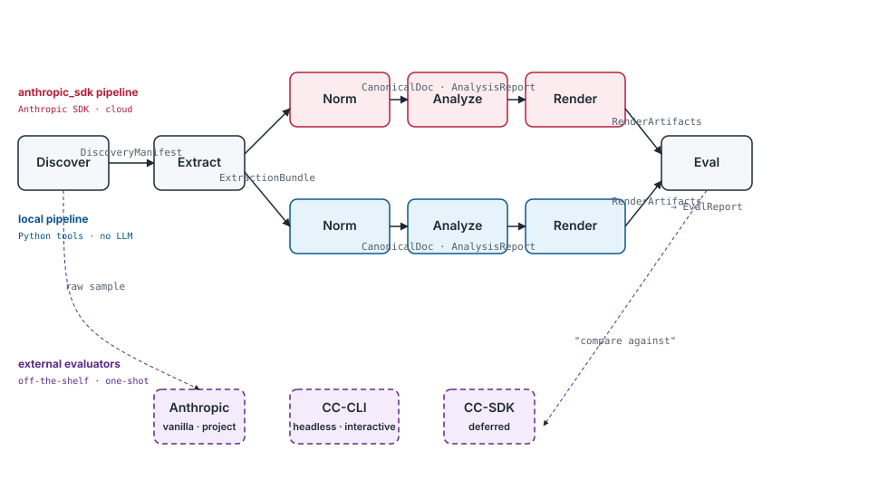

## Core idea

Every pipeline stage consumes one JSON contract and emits another. A gate validator sits between each pair. If validation fails, the pipeline stops.

```text
stage(ContractA) → validate → stage(ContractB) → validate → ...
```

## Two runtime modes

**Runner** (0.2.0) — in-process stage chain. Python callables, direct function calls.

**Stream** (0.3.0) — NDJSON over stdin/stdout. Same stages, CLI-composable. Built on top of the runner.

```text
In-process:  runner.run([discover, extract, normalize, analyze, draft])
CLI:         discover | extract | normalize | analyze | draft
```

Both use the same contracts and the same gate validator.

## Stage graph

```text
Discover → ExtractionBundle → CanonicalDoc → AnalysisReport → EvalReport
         ↑                                                       ↓
   DiscoveryManifest                                        pass/warn/fail
```

Reserved stages (stub contracts, wired later):

- Classify → ClassificationManifest
- RecognizeInputFormat → FormatMatch
- CheckOutputConformance → FormatConformance
- Format definitions → InputFormat, OutputFormat

## Package layout

```text
src/doc_pipeline_engine/
  models/                           Pydantic v2 contract models (load-bearing interface)
  base/contracts.py                 Pydantic-backed gate validator (validate / is_valid)
  base/adapter.py                   Adapter ABC (0.4.0)
  runner.py                         Stage chain runner (0.2.0)
  cli.py                            NDJSON CLI wrappers (0.3.0)
  stages/                           Stage implementations (0.2.0+)
```

Each contract has a single Pydantic model under `models/`; the JSON
Schema view is regenerated on demand via `python -m
doc_pipeline_engine.models dump <Name>` (no on-disk schema files).

## Standalone by design

No hard dependencies on any orchestrator or consumer. Contracts are the public API. Any system that can produce/consume the JSON schemas can participate — polyforge, office-polyforge, Claude Code plugins, or anything else.

## Output tiers

| Tier | Extraction | Template | Eval |
| ------ | ----------- | ---------- | ------ |
| **Quick** | Headings + key claims + top-5 entities | 1-page Markdown summary | Smoke (schema + 1 faithfulness) |
| **Comprehensive** | Full canonical tree + RAG index + tables/figures/citations | IMRaD / tech-spec | RAGAs + TruLens + human-in-loop |

Quick draft always produced first — doubles as the executive summary inside comprehensive output.

## Design decisions

Architectural decisions live as ADRs under [`adr/`](adr/index.md). Quick index of the made decisions:

- [ADR-0006](adr/0006-apache-2-0-with-notice-over-mit.md) — Apache-2.0 with NOTICE over MIT
- [ADR-0007](adr/0007-two-surface-split-engine-and-control-plane.md) — Two-surface split (engine vs control plane)
- [ADR-0008](adr/0008-hatchling-and-uv-over-setuptools-and-pip.md) — Hatchling + uv over setuptools + pip
- [ADR-0009](adr/0009-ten-contracts-with-five-simplified-stubs.md) — 10 contracts shipped with 5 simplified stubs
- [ADR-0010](adr/0010-samples-gitignored-with-download-script-as-sot.md) — Samples gitignored; download script is the single source of truth

**Four orchestration patterns** (to be evaluated; no ADR yet) — P1: plain skill chain, P2: parallel subagents, P3: team mode, P4: hybrid. All run the same stage graph; they differ in who runs each stage. Contracts are orchestration-agnostic by design.
